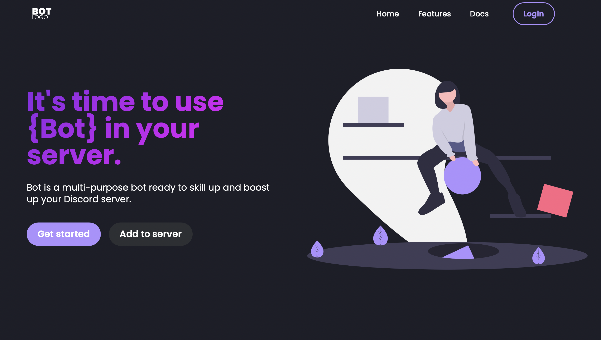

# 🚀 Discord Bot Website Template

## 🖼️ Screenshots

## 📝 About the Project

Today, I'm excited to share with you a Discord Bot Website Template (landing page only), available for free! As a developer myself, I know the struggle of finding visually appealing and responsive templates for showcasing projects. So, I decided to create this template to make it easier for bot creators like you to present your creations to the world. Whether you're a seasoned developer or just starting out, this template is designed to help you make a strong first impression with your Discord bots.

## 🛠️ Technologies Used

List of the technologies/frameworks/libraries used:

- Bootstrap
- HTML
- CSS
- Mobirise (basic base)

## ⚙️ Installation

Steps to install:

1. Fork the repository or clone it: git clone https://github.com/BardothWeb/Discord-Bot-Website-Template.git
2. Open the index.html file in your browser.

## 🖥️ Usage

To use this template, simply clone or fork the repository and customize it according to your needs. Add your bot's information, tweak the design, and make it your own! Once customized, you can host it on platforms like GitHub Pages or Netlify to showcase your Discord bot to the world.

## 🤝 Contributing

If you'd like to contribute to this project, please follow these steps:

1. Fork the repository
2. Create a new branch (`git checkout -b feature`)
3. Make your changes
4. Commit your changes (`git commit -am 'Add new feature'`)
5. Push to the branch (`git push origin feature`)
6. Create a new Pull Request

## 📄 License

This project is licensed under the [MIT License](https://opensource.org/licenses/MIT) - see the [LICENSE](LICENSE) file for details.
Please leave a credit when using this template.

## 🖼️ Image Credits and Licensing

Some of the images used in this template are sourced from external platforms such as Freepik and undraw. Please ensure that you review and respect the licenses associated with these images:

- [Freepik License Agreement](https://www.freepikcompany.com/legal#nav-freepik)
- [undraw License Agreement](https://undraw.co/license)

## 📧 Contact

If you have any questions or feedback, feel free to contact me:

Discord: .bardoth
